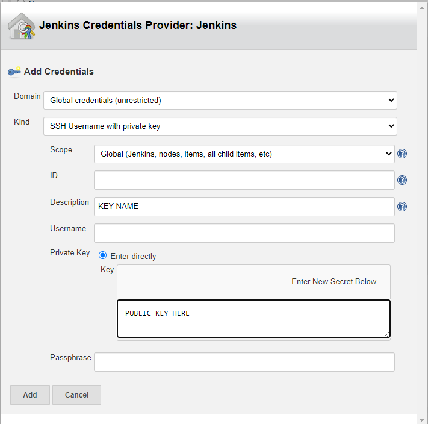

# Jenkins and CI

## CI/CD

**C**ontinuous **I**ntegration and **C**ontinuous **D**elivery (or **D**eployment)

- One of best practices for DevOps teams to implement 

**Continuous Integration**

Coding philosophy and set of practices to establish a consistent and automated way to build, package, and test applications
- Teams can implement small changes and very swiftly receive feedback to see if there are any errors or bugs
- The consistency of the integration process enables teams to commit code changes more frequently, leading to better collaboration and software quality


**Continuous Delivery**

Automates the delivery of applications to selected infrastructure environments
- Most teams work with multiple environments (development, testing, and production)
	- CD ensures that there is an automated way to push code changes


CI/CD require continuous testing as the objective is to deliver quality applications and code to users

A mature CI/CD DevOps practice has the option of implementing continuous deployment where application changes run through the CI/CD pipeline and passing builds are deployed directly to production environments 

## Jenkins

**Jenkins is an open source automation server which enables teams to build their own CI/CD pipelines**

Jenkins receives any code changes from a Github repository via a webhook (any changes are set up to be automatically sent to Jenkins, rather than Jenkins constantly checking for changes)

Jenkins then sends the code to an _Agent Node_ (i.e. the testing environment) where the code is
- Setup
- Tested

If anything fails, Jenkins provides feedback to the Dev team so they can make any necessary changes

## Setting Up a Job

Create a new Item in Jenkins, for now selecting _Freestyle Project_, where there are several settings to configure

### General
- **Description**: optional
- **Discard old builds**: turn on with 2 (optional) max number of builds to keep
- **GitHub project**: project url (e.g. ``https://github.com/user/repo_name``)

### Office 365 Connector
- **Restrict where this project can be run**: logical expression to specify which agent to execute builds of the project (e.g. ``sparta-ubuntu-node``)

### Source Code Management

Select **Git**, this is where the connection to the GitHub repository can be configured

- **Repository URL**: URL for repo found in _Code_-->_Clone_-->_SSH_ (e.g. ``git@github.com:user/repo_name.git``)
- **Credentials**: This is where the SSH key is added

**SSH Keys with Jenkins and Github**

- Navigate to directory where SSH keys are stored with
```bash
cd ~/.ssh
```
- Generate a new SSH key with
```bash
ssh-keygen -t ed25519
```
- Enter the file name to save the key to after being prompted, and leave the passphrases empty
- Add the private key (file with no ``.pub`` extension) to GitHub (_Settings_-->_SSH and GPG keys_-->_New SSH key_)
- Add the public key (file with ``.pub`` extension) to Jenkins by _adding a key_


- **Branches to build**: specify which branch to build, (e.g. ``*/main``)

### Build Triggers

- **GitHub hook trigger for GITScm polling**: Check this option to trigger Jenkins to build when detecting pushes from the GitHub repository

### Setting Up a Webhook

The final step is crucial to setting up the communication between GitHub and Jenkins.

Setting up the webhook allows GitHub to trigger Jenkins to start a new build whenever a new commit is pushed.

In the GitHub repository that is to be linked to Jenkins, create a new Webhook (_Settings_-->_Webhooks_-->_Add webhook_)

- **Payload URL**: Add the URL (usually specified with ip and port) with ``/github-webhook/`` appended at the end
- **Content type**: Select ``application/json``

Any new pushes to the repository should now trigger a new build, shown in _Build History_ where the _Console Output_ can be read for each individual build